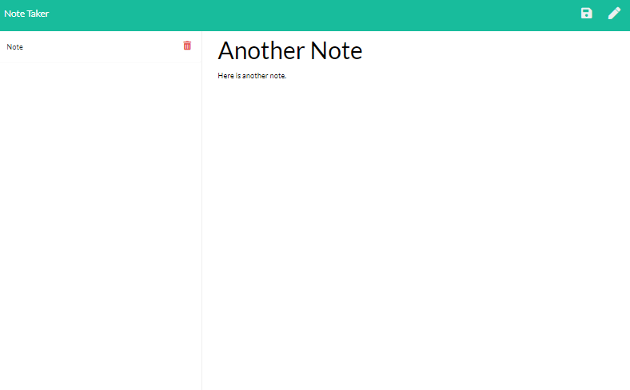

#  Note Taker

This web application is for users to keep track of general information.  Users are able to create, view and delete notes.  The notes are persisted in this application.

 
 

## Table of Contents

* [Installation](#Installation)
* [Usage](#Usage)
* [License](#License)
* [Contributing](#Contributing)
* [Tests](#Tests)
* [Questions](#Questions)

 
 

## Installation

Open a web browser and browse to https://damp-plateau-44771.herokuapp.com/

 
 

## Usage

Once you are on the main page, click "Get Started".  Enter the title of the note in the "Note Title" area and the body of the note in the "Note Text" area.  Then, click the save button in the top right hand corner.  If you want to delete a note, you can click on the trash can icon next to the title of the previously saved notes.

 
 

## Screenshot Desktop

 
 

## Screenshot Mobile

 
 

## License

[MIT](https://choosealicense.com/licenses/mit/)

 
 

## Contributing

If you would like to contribute to the project, please open an issue in the main GitHub repository so we can further discuss the contribution.

 
 

## Tests

No tests are specified at this time.

 
 

## Questions  

If you have questions about the project you can email me, or you can open an issue in the GitHub repository.

My GitHub profile is [benjDG](https://github.com/benjDG)  
  
Email: bdgalloway85@gmail.com.  
